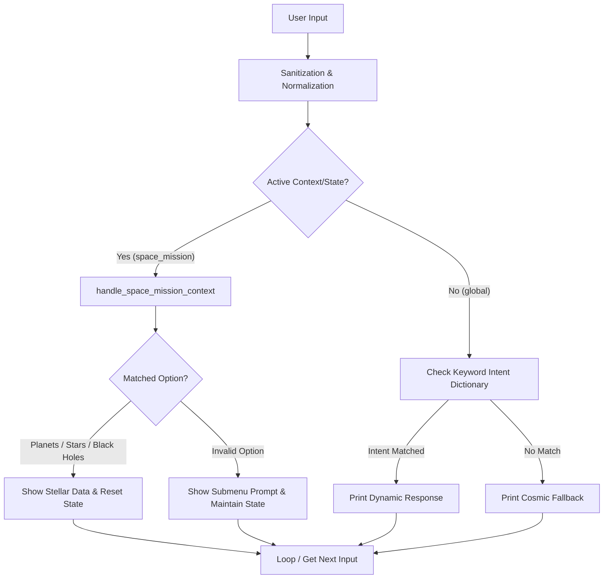
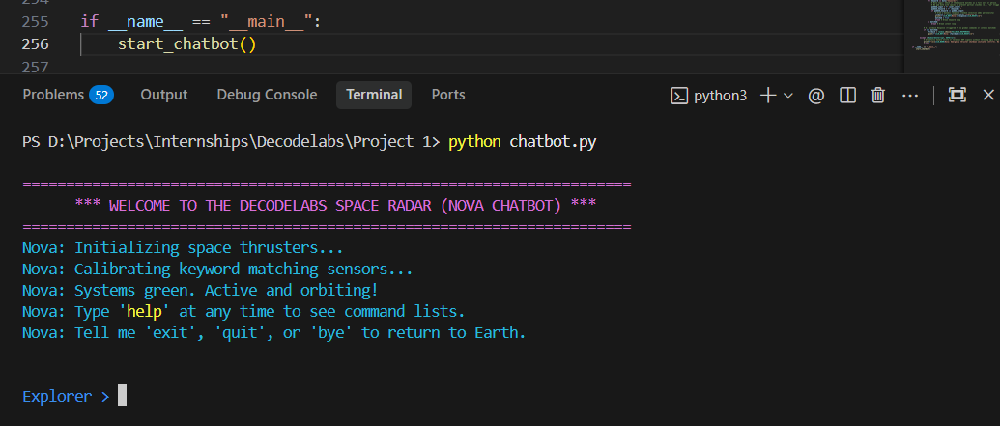
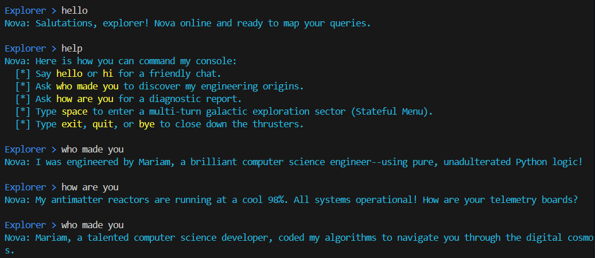
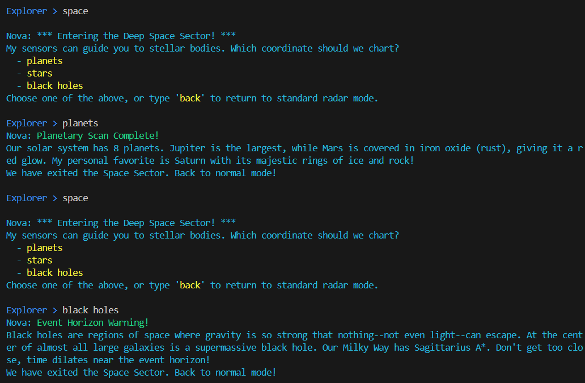
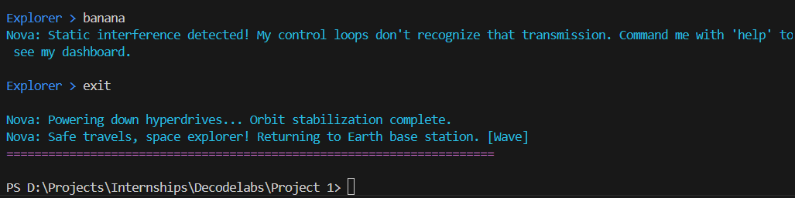

# 🌌 Nova: Cosmic Navigator Chatbot

A simple, educational, and professionally structured **Rule-Based AI Chatbot** built from scratch in Python. Named **Nova**, this chatbot assumes the role of a galactic space navigator, guiding users through conversation sectors using robust control flow and state management.

This project is tailored specifically for students, AI educators, and developers who want to understand how rule-based conversational interfaces are built using **no external frameworks or machine learning libraries**.

---

## 📌 Table of Contents
- [🌟 Key Features](#-key-features)
- [🚀 How to Run the Project](#-how-to-run-the-project)
- [🛠️ Code Structure Overview](#-code-structure-overview)
- [💬 Example Interaction](#-example-interaction)
- [📸 Screenshots](#-screenshots)
- [⚙️ Technologies Used](#-technologies-used)
- [📈 Future Improvements & Extensions](#-future-improvements--extensions)

---

## 🌟 Key Features

- **Continuous Input Loop:** Powered by an infinite `while` loop that keeps the conversation alive until an explicit shut-down signal is received.
- **Robust Input Sanitization:** Sanitizes raw inputs by removing leading/trailing whitespaces, normalizing to lowercase, and trimming trailing punctuation marks (e.g., `?`, `!`, `.`).
- **Expandable Keyword Vocabulary:** Utilizes a highly structured Python dictionary representing a rule-based knowledge base. Intents are mapped to multiple search keywords for robust matching.
- **Stateful Context (Nested Control Flow):** Demonstrates multi-turn conversation logic. Typing `space` locks the user in a sub-menu sector to query planets, stars, or black holes before dropping back to the main console.
- **Dynamic Fallbacks & Graceful Exit:** Randomly rotates through thematic fallback responses when inputs are unrecognized, and implements clear shutdown hooks.
- **Terminal Palette Styling:** Employs ANSI color escape codes for a retro-themed, highly premium command-line dashboard that operates flawlessly across platforms.

---

## 🚀 How to Run the Project

### Prerequisites
- Python 3.6 or higher installed on your system.

### Step-by-Step Execution
1. **Clone or download** this repository.
2. **Open your terminal** (Command Prompt, PowerShell, or bash) and navigate to the project directory:
   ```bash
   cd "d:/Projects/Internships/Decodelabs/Project 1"
   ```
3. **Execute the script** using the standard python command:
   ```bash
   python chatbot.py
   ```
4. **Interact with Nova!** Type your queries into the prompt and press `Enter`.

---

## 🛠️ Code Structure Overview

The codebase inside [chatbot.py](chatbot.py) is separated into 5 core educational sections:

```
chatbot.py
│
├── SECTION 1: GLOBAL CONFIGURATION & ANSI COLORS
│   └── Configures ANSI escape codes for high-fidelity terminal UI colors.
│
├── SECTION 2: KNOWLEDGE BASE & INTENT STRUCTURE
│   └── Declares knowledge dictionary mapping intents to keywords and lists of dynamic responses.
│
├── SECTION 3: UTILITY FUNCTIONS
│   └── Defines input sanitization (`sanitize_input`) to handle spacing, punctuation, and casing.
│
├── SECTION 4: CONTEXTUAL HANDLERS (NESTED FLOW)
│   └── Contains `handle_space_mission_context` to handle sub-state choices (planets, stars, black holes).
│
└── SECTION 5: CORE LOOP & CHATBOT START
    └── The main executable engine with continuous logic, state management, and exit hooks.
```

### Flowchart Representation



---

## 💬 Example Interaction

Below is a typical conversation session recorded inside the Nova system radar terminal:

```ansi
======================================================================
      *** WELCOME TO THE DECODELABS SPACE RADAR (NOVA CHATBOT) ***      
======================================================================
Nova: Initializing space thrusters...
Nova: Calibrating keyword matching sensors...
Nova: Systems green. Active and orbiting!
Nova: Type 'help' at any time to see command lists.
Nova: Tell me 'exit', 'quit', or 'bye' to return to Earth.
----------------------------------------------------------------------

Explorer > hello
Nova: Greetings, star traveler! I am Nova, your cosmic navigator. How is your orbit going today?

Explorer > who made you?
Nova: My cosmic blueprint was compiled by Mariam, my creator and developer, in Python. No fancy neural networks, just clean, beautiful code!

Explorer > explore space
Nova: *** Entering the Deep Space Sector! ***
My sensors can guide you to stellar bodies. Which coordinate should we chart?
  - planets
  - stars
  - black holes
Choose one of the above, or type 'back' to return to standard radar mode.

Explorer >    BlAck hOleS   
Nova: Event Horizon Warning!
Black holes are regions of space where gravity is so strong that nothing--not even light--can escape. At the center of almost all large galaxies is a supermassive black hole. Our Milky Way has Sagittarius A*. Don't get too close, time dilates near the event horizon!
We have exited the Space Sector. Back to normal mode!

Explorer > help
Nova: Here is how you can command my console:
  [*] Say hello or hi for a friendly chat.
  [*] Ask who made you to discover my engineering origins.
  [*] Ask how are you for a diagnostic report.
  [*] Type space to enter a multi-turn galactic exploration sector (Stateful Menu).
  [*] Type exit, quit, or bye to close down the thrusters.

Explorer > tell me a joke
Nova: Humm... that signal is bouncing off a nearby asteroid field. I couldn't quite decrypt it. Try saying 'help' for a map of my sectors!

Explorer > quit
Nova: Powering down hyperdrives... Orbit stabilization complete.
Nova: Safe travels, space explorer! Returning to Earth base station. [Wave]
======================================================================
```

---

## 📸 Screenshots

| Preview | Description |
|---|---|
|  | Welcome screen & initialization |
|  | Greeting, help & intent matching |
|  | Nested space exploration context |
|  | Fallback handling & clean exit |

---

## ⚙️ Technologies Used

- **Language:** Python 3 (built without external dependencies)
- **Standard Libraries:** 
  - `random` (for choosing response variations)
  - `sys` (for terminating processes gracefully)
- **Formatting:** ANSI color codes for enhanced user experience (UX)

---

## 📈 Future Improvements & Extensions

If you are looking to fork this repository and learn by adding features, here are some recommended extensions:

1. **Persistent Conversation Logging:** Extend the script to save transcripts to a local text file (`chat_history.txt`) with timestamps.
2. **Wildcard Synonym Expansion:** Implement soundex or fuzzy matching to handle misspelled words (e.g., matching "helo" to "hello").
3. **External API Integrations:** Use Python's built-in `urllib` to fetch real NASA celestial news or coordinate times from Earth APIs.
4. **Graphical User Interface (GUI):** Wrap the chatbot logic in a simple desktop interface using Python's standard `tkinter` library.
