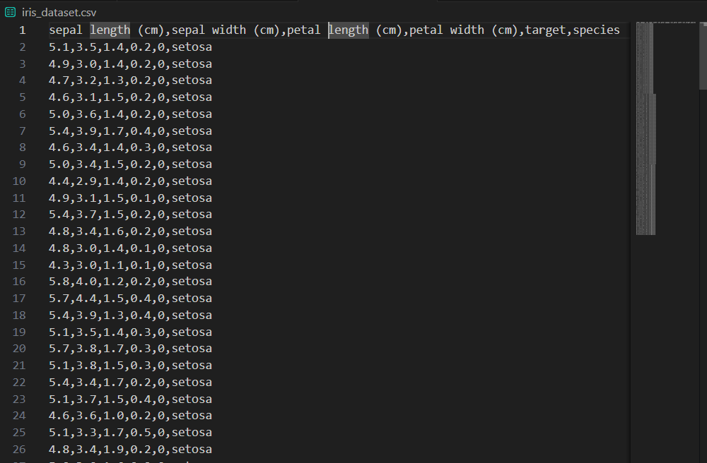
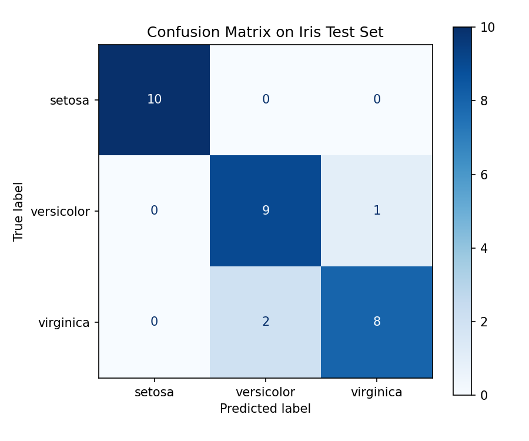
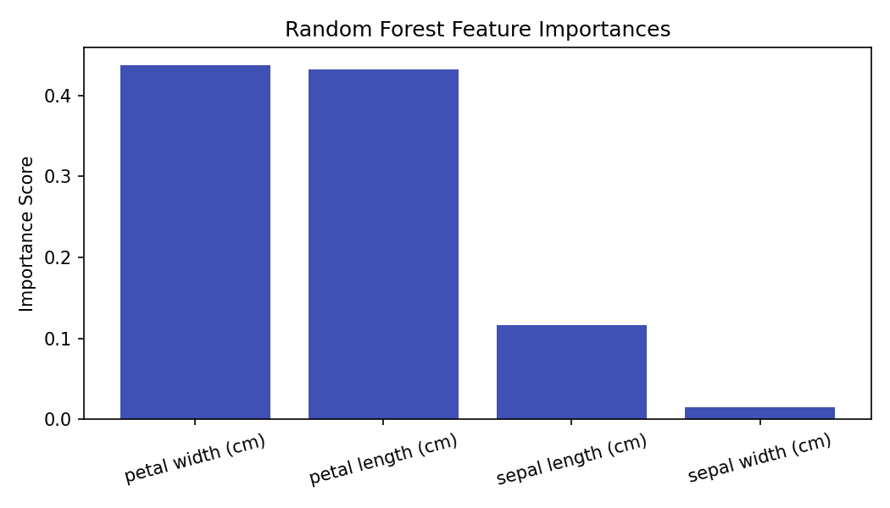
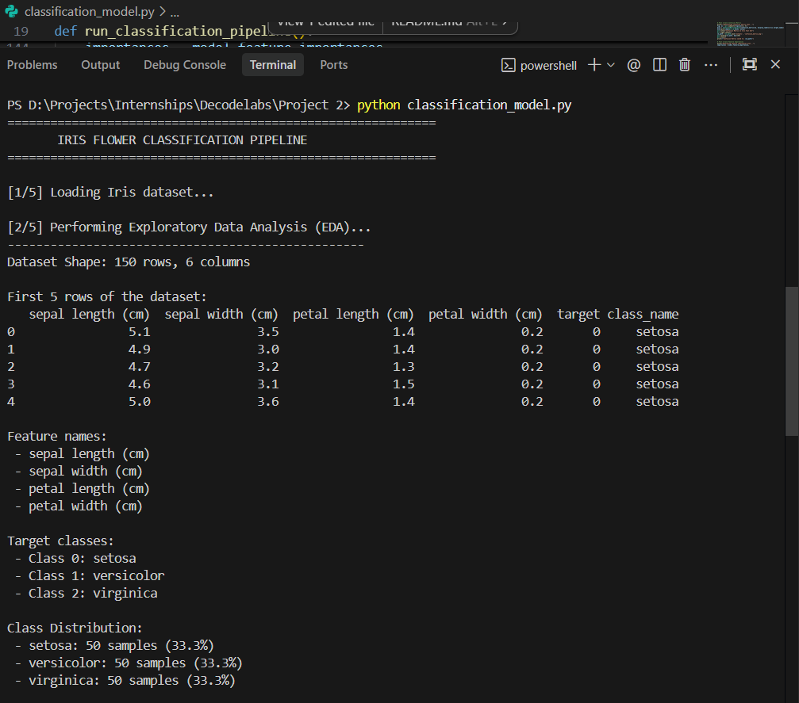
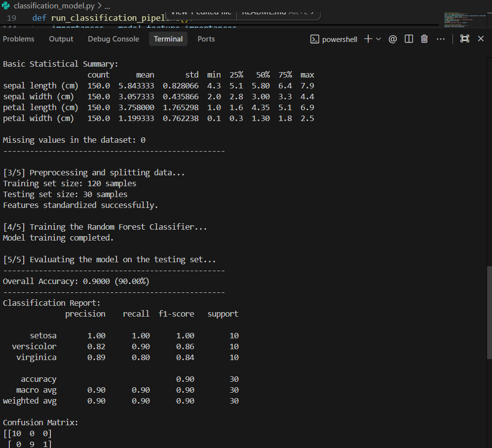
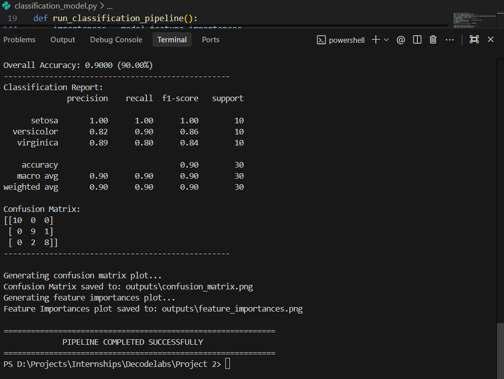

# Project 2: Data Classification Using AI

This repository contains a basic data classification pipeline using supervised learning. It loads the classic Iris dataset, performs exploratory data analysis (EDA), standardizes features, splits the data, trains a Random Forest Classifier, and evaluates performance.

## Getting Started

### Prerequisites

You will need Python 3 installed along with the following libraries:
- `pandas`
- `numpy`
- `matplotlib`
- `scikit-learn`

If needed, you can install them using:
```bash
pip install pandas numpy matplotlib scikit-learn
```

### Running the Classification Model

Execute the script using:
```bash
python classification_model.py
```

---

## Pipeline Summary & Results

### 1. The Dataset
I have used the classic **Iris Flower Dataset** containing 150 samples (50 for each of three flower species). A copy of the raw dataset has been saved to [iris_dataset.csv](file:///d:/Projects/Internships/Decodelabs/Project%202/iris_dataset.csv).

#### Dataset Preview


* **Features (4 numeric measurements)**:
  * Sepal length (cm)
  * Sepal width (cm)
  * Petal length (cm)
  * Petal width (cm)
* **Target Classes**:
  * `setosa` (Class 0)
  * `versicolor` (Class 1)
  * `virginica` (Class 2)
* **Missing Values**: None (0 missing values).
* **Class Distribution**: Balanced with 50 samples (33.3%) per class.

---

### 2. Preprocessing & Splitting
* **Split**: 80% training (120 samples) and 20% testing (30 samples), stratified to preserve target class balance.
* **Feature Scaling**: Standardized using `StandardScaler` (mean = 0, standard deviation = 1) for optimal model training.

---

### 3. Model Architecture
* **Model**: `RandomForestClassifier` (100 estimators)
* **Reproducibility**: Set `random_state=42` for consistent outputs across runs.

---

### 4. Evaluation Metrics
On the 30-sample testing set, the model achieved **90.00% overall accuracy**:

```text
              precision    recall  f1-score   support

      setosa       1.00      1.00      1.00        10
  versicolor       0.82      0.90      0.86        10
   virginica       0.89      0.80      0.84        10

    accuracy                           0.90        30
   macro avg       0.90      0.90      0.90        30
weighted avg       0.90      0.90      0.90        30
```

#### Confusion Matrix Details
```text
[[10  0  0]
 [ 0  9  1]
 [ 0  2  8]]
```
* **Setosa**: 10/10 correctly classified.
* **Versicolor**: 9/10 correctly classified (1 misclassified as `virginica`).
* **Virginica**: 8/10 correctly classified (2 misclassified as `versicolor`).

---

### 5. Visualizations & Outputs

Here are the results and performance charts generated by the pipeline:

#### A. Confusion Matrix Heatmap


#### B. Feature Importances Chart


---

### 6. Full Terminal Execution Logs

The step-by-step pipeline execution logs from the terminal:

| Terminal Output - Part 1 (Loading & EDA) |
|:---:|
|  |

| Terminal Output - Part 2 (Preprocessing & Training) |
|:---:|
|  |

| Terminal Output - Part 3 (Evaluation) |
|:---:|
|  |
