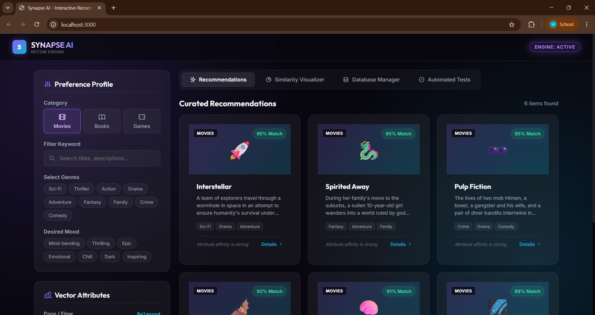
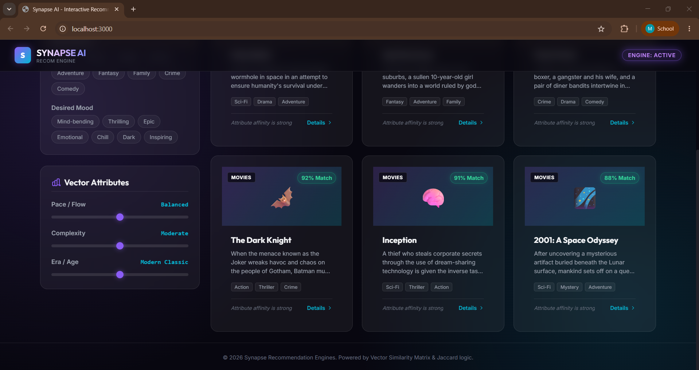
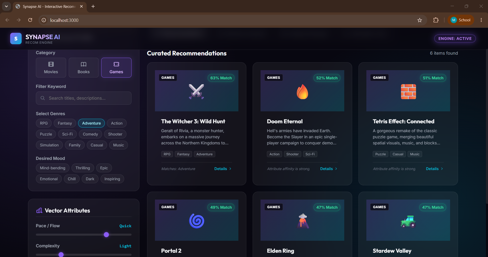
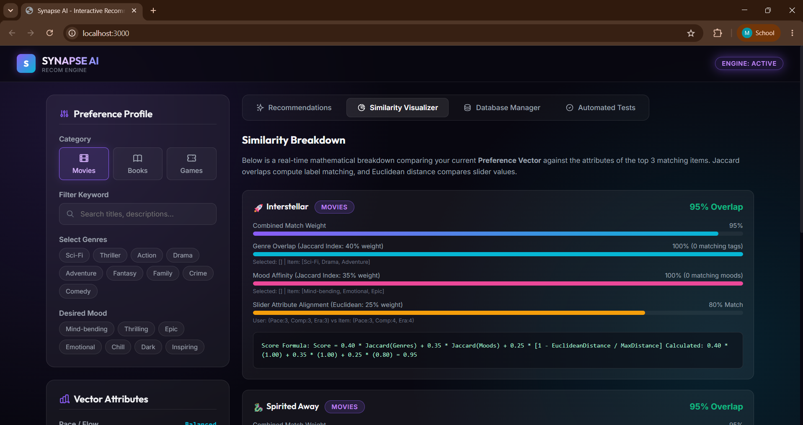
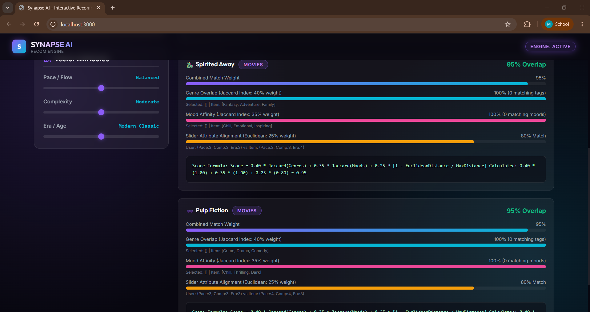
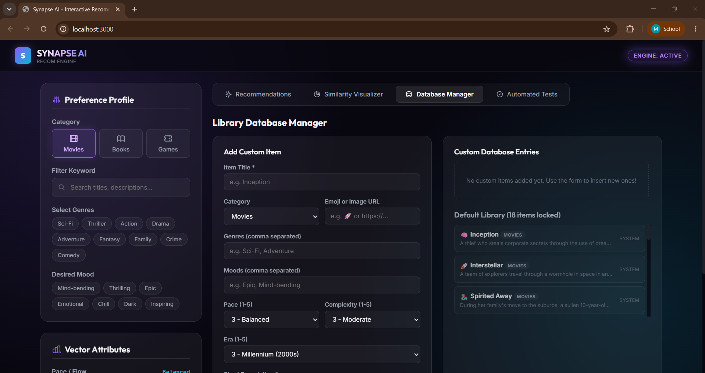
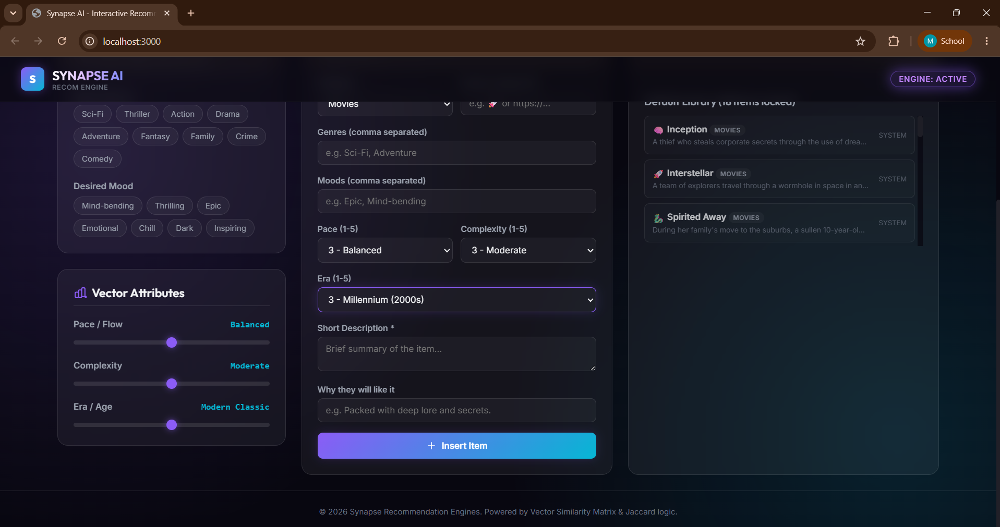
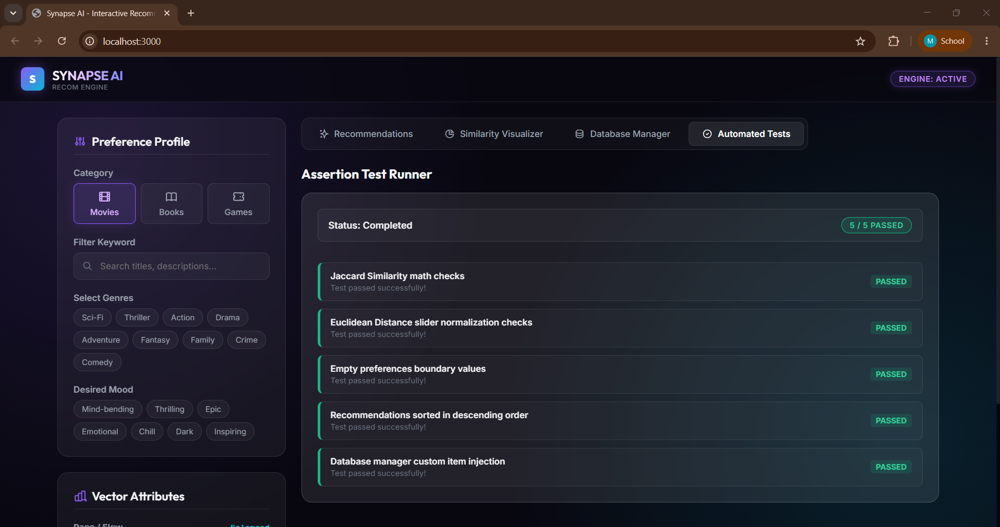

# Synapse AI — Interactive Recommendation Engine

An advanced, premium client-side recommendation engine that demonstrates vector similarity matching and set-based classification logic in real-time.

---

## 📸 Project Showcase

### 1. Recommendations Dashboard
Explore the initial home view displaying curated default entries for movies, books, and games.



### 2. Preference Filtering & Real-time Matching
Select genres, choose a desired mood, and adjust vectors. The engine updates matches instantly.


### 3. Detailed Recommendations & Actions
Learn exactly why items were recommended and click to trigger simulated playback or previews.


### 4. Mathematical Similarity Visualizer
Inspect real-time, side-by-side mathematical breakdowns of the engine's similarity computations.



### 5. Local Database Manager
Inject your own custom items into the recommendation pool or delete existing custom records.



### 6. Automated Test Suite
Run built-in assertion tests verifying vector normalization, calculations, sorting, and storage.


---

## 🚀 Key Features

* **Multi-Category Engine**: Seamlessly switch between Movie, Book, and Game recommendation systems with context-aware genre options.
* **Vector Profile Tuning**: Slide vectors for **Pace/Flow**, **Complexity**, and **Era** to define a custom user preference matrix.
* **Similarity Breakdown Graphic**: Visualizes the detailed calculations that drive the recommendation percentage score.
* **Custom Data Injection**: Insert new records through an interactive form, saved and persistent in the user's browser via `localStorage`.
* **Toast & Modal Interfaces**: Modern micro-interactions, custom scrollbars, and premium animations.
* **Embedded Unit Testing Suite**: An inline unit test runner with real-time assertions on key mathematical algorithms.

---

## 🧮 Mathematical Architecture

Synapse AI determines recommendations by fusing two distinct types of mathematical similarities:

### 1. Set-Based Attributes (Jaccard Index)
To compare tags where counts are not relevant—such as **Genres** ($G$) and **Moods/Tones** ($M$)—the engine calculates the **Jaccard Similarity Index**. It measures the ratio of overlap between the user's selected preferences ($U$) and the item's tags ($I$):

$$J(U, I) = \frac{|U \cap I|}{|U \cup I|}$$

In JavaScript:
```javascript
function calculateJaccardSimilarity(userSet, itemArray) {
  if (userSet.size === 0) return 1.0; // If no filters are active, do not penalize
  
  const itemSet = new Set(itemArray);
  const intersection = new Set([...userSet].filter(x => itemSet.has(x)));
  const union = new Set([...userSet, ...itemSet]);
  
  return intersection.size / union.size;
}
```

### 2. Numeric Vector Attributes (Euclidean Distance)
For continuous attributes (Pace, Complexity, and Era), items and user preferences are mapped as coordinates in 3-dimensional space:

$$V = [\text{pace}, \text{complexity}, \text{era}]$$

The distance between the User Vector ($V_U$) and the Item Vector ($V_I$) is computed using **Euclidean Distance**:

$$d(V_U, V_I) = \sqrt{(p_U - p_I)^2 + (c_U - c_I)^2 + (e_U - e_I)^2}$$

To translate this distance into a similarity score, it is normalized by the maximum possible distance in a 3D coordinate space bounded by $[1, 5]$ (which is $\sqrt{4^2 + 4^2 + 4^2} \approx 6.9282$):

$$\text{Similarity}_{\text{attr}} = 1 - \frac{d(V_U, V_I)}{\text{Max Distance}}$$

### 3. Weighted Fusion Score
The final matching percentage represents a weighted sum of the three scores, prioritizing categorical descriptors:

$$\text{Match Score} = \left(0.40 \cdot \text{Similarity}_{\text{genres}} + 0.35 \cdot \text{Similarity}_{\text{moods}} + 0.25 \cdot \text{Similarity}_{\text{attributes}}\right) \times 100$$

---

## 🛠️ Tech Stack & Structure

* **Frontend Structure**: HTML5 Semantic Architecture ([index.html](file:///d:/Projects/Internships/Decodelabs/Project%203/index.html))
* **Style Engine**: Vanilla CSS3 Custom Variables, Flexbox, CSS Grid, Glassmorphism, Accent Glows ([style.css](file:///d:/Projects/Internships/Decodelabs/Project%203/style.css))
* **Logic Core**: Vanilla ES6 JavaScript Event Handlers, LocalStorage database adapters, vector calculators ([app.js](file:///d:/Projects/Internships/Decodelabs/Project%203/app.js))

---

## 🔌 Running Locally

Since the app runs client-side, you only need to serve the root folder:

### Using Python:
```powershell
python -m http.server 8000
```
### Using Node (serve):
```powershell
npx serve .
```

Navigate to `http://localhost:8000` (or the respective port) in your web browser.

---

## 🧪 Automated Testing

Click on the **Automated Tests** tab in the main tab menu. This runs a five-part unit test suite directly within the browser runtime. The assertions verify:
1. `Jaccard Similarity math checks`: Edge and value cases for set overlap algorithms.
2. `Euclidean Distance slider normalization checks`: Correct distance calculations and bounds.
3. `Empty preferences boundary values`: Prevents division-by-zero or `NaN` errors on raw profile loads.
4. `Recommendations sorted in descending order`: Checks sorting accuracy.
5. `Database manager custom item injection`: Confirms data pipelines read and update storage arrays correctly.
